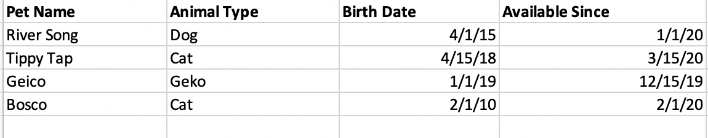

# River’s Ark Animal Adoption Center Database
In this assignment, you will create a simple database to manage animal adoption data.

## Objectives
By the end of this assignment, you will be able to ...
* Create and drop a database.
* Create and drop a table.
* Alter a table.
* Insert, update and delete rows in a table.
  
## Overview
Your client, *River’s Ark Animal Adoption Center*, is having their 5th anniversary adopt-a-thon event and would like you to develop a database to track adoptions. One of the main goals of this database is to be able to track animals that are currently up for adoption and which animals have been adopted already.

In this assignment, you will create and manage a table and its data to hold animals that are up for adoption.

## Instructions
Before you begin, make sure you have MySQL installed and running on your machine (instructions given previously) and have MySQL Workbench installed.

### Clone repository
Clone this repository to your machine. Open MySQL Workbench and connect to your local database server (localhost or 127.0.0.1). Open the provided *rivers_ark_db.sql* in Workbench. All queries should be written and saved in this file.

### Create database and adoptee table
Our client would like to start the project by having an initial table to hold animals that are up for adoption. 

First, create a database with the name *rivers_ark*. After creating the database make sure to indicate that you would like to use this database for the coming queries by entering the following ...
```sql
use rivers_ark;
```

Next create a table named *adoptees* with the following information:
* id - surrogate primary key.
* pet_name  - the name of the animal
* animal_type - the type of animal such as “Dog”, “Cat”, or “Llama”.
* birth_date - the approximate birth date of the animal.
* adopted - indicates if the animal has been adopted ... use 1 to indicate the animal was adpopted and 0 if not.
* status_date - the date that the animal was placed up for adoption or the date that they were adopted.

The id should be unrelated to the data of the adoptee (surrogate id) and should be an auto-incrementing integer. Use the most appropriate data type for all the other fields. All fields are required and should not be null. 

### Insert adoptee data
The image below contains all the animals currently up for adoption at River’s Ark. Write insert statements for each row shown and execute them.



>All the animals on the list are up for adoption, so the *adopted* attribute will be *0*. The status_date should be populated with the data under “Available Since”.

### Update adoption status
*Bosco* has just been adopted. Write an update query to change *Bosco's* *adopted* attribute to *1* with a status date of today.

### Alter the adoptee table
Our client has just told us that they would like to have a description for each adoptee. Write an alter statement to add a *description* field.  This field should be optional (use the most appropriate data type).

After you execute this statement, write an update statement to give the animal *Tippy Tap* the following description ... "Plays well with other animals, but she has a problem with children. Keep her away from children at all times!"

### Delete an adoptee
Our client informed us there was an erroneous entry in the adoptees they gave us. They don’t handle gekos and will need to transfer him somewhere else. 

Issue a delete statement to remove the pet named “Geico” from the database.

## Submission
Commit your changes and push this project to GitHub with a commit message of "Finished" to submit for grading.

